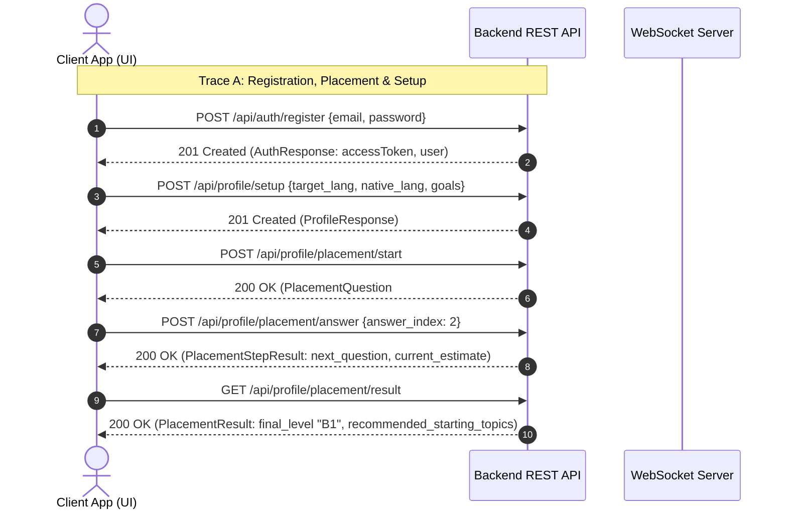
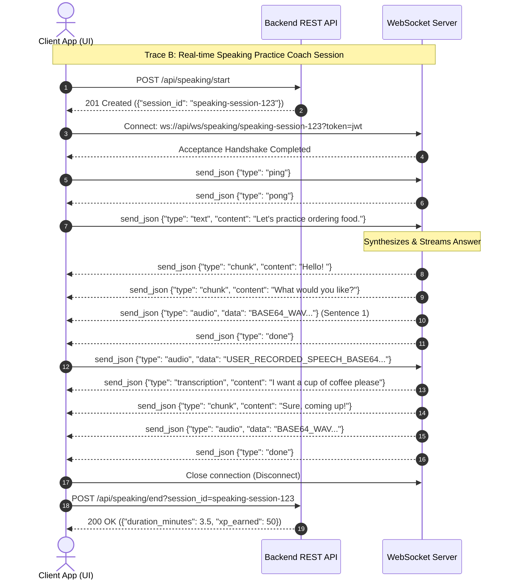
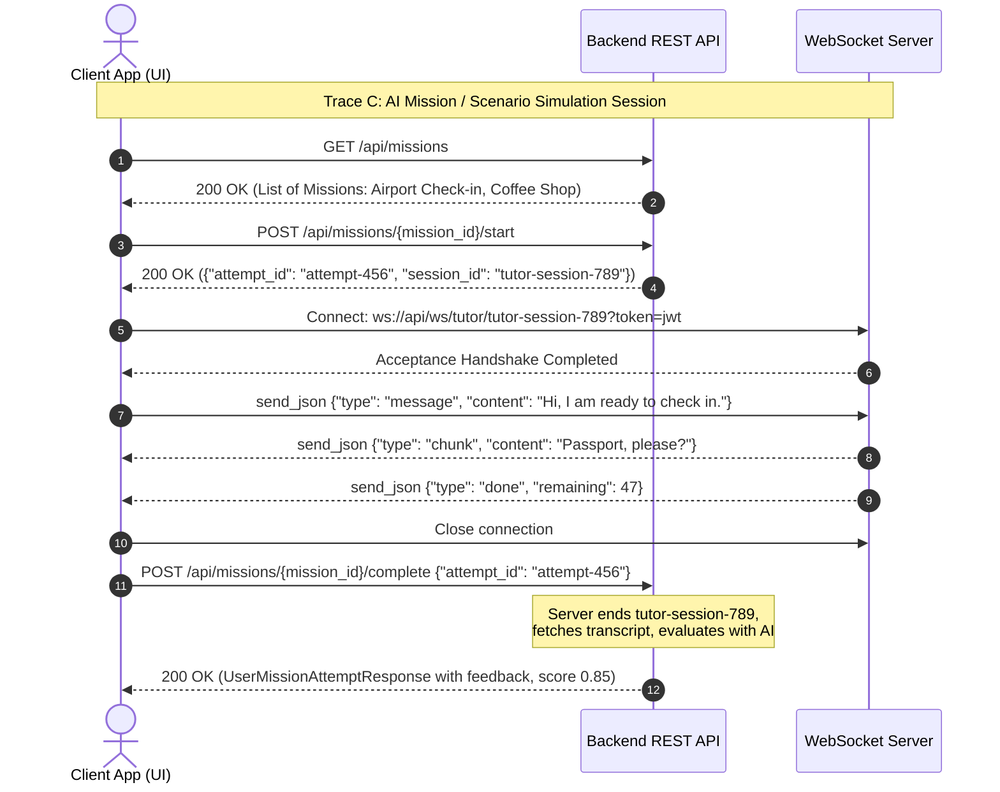

# FRONTEND HANDOVER & API CONTRACT SPECIFICATION
**Version:** 1.0.0  
**Environment:** Development & Production  
**Document Classification:** Technical Contract (Source of Truth)  
**Target Audience:** Frontend AI Builder / Frontend Engineering Team  

This document serves as the strict, absolute contract and source of truth for the interaction between the frontend client and the `LinguistAI` backend. It defines all REST API endpoints, real-time WebSocket messaging systems, data models, authentication policies, rate limits, and test data shapes. **No deviations from these specifications are permitted.**

---

## 1. REST API SPECIFICATION

All REST requests are prefixed by `/api` (automatically routed by FastAPI middleware). 

Below is the complete OpenAPI 3.0.3 specification in YAML format. It lists every resource, parameter, request payload, status code, and header.

```yaml
openapi: 3.0.3
info:
  title: LinguistAI Backend API
  version: 1.0.0
  description: Comprehensive contract for the LinguistAI language learning platform backend.
servers:
  - url: http://localhost:8000/api
    description: Local development server
  - url: https://api.linguistai.com/api
    description: Production environment
paths:
  # --- AUTHENTICATION ---
  /auth/register:
    post:
      summary: Register a new user account
      tags:
        - Authentication
      requestBody:
        required: true
        content:
          application/json:
            schema:
              $ref: '#/components/schemas/RegisterRequest'
      responses:
        '201':
          description: User registered successfully
          content:
            application/json:
              schema:
                $ref: '#/components/schemas/AuthResponse'
        '400':
          $ref: '#/components/responses/ErrorResponse'
        '422':
          $ref: '#/components/responses/ValidationError'

  /auth/login:
    post:
      summary: Log in with email and password
      tags:
        - Authentication
      requestBody:
        required: true
        content:
          application/json:
            schema:
              $ref: '#/components/schemas/LoginRequest'
      responses:
        '200':
          description: Login successful
          content:
            application/json:
              schema:
                $ref: '#/components/schemas/AuthResponse'
        '401':
          $ref: '#/components/responses/ErrorResponse'

  /auth/refresh:
    post:
      summary: Refresh JWT access token using a valid refresh token
      tags:
        - Authentication
      requestBody:
        required: true
        content:
          application/json:
            schema:
              $ref: '#/components/schemas/RefreshRequest'
      responses:
        '200':
          description: Token refreshed successfully
          content:
            application/json:
              schema:
                $ref: '#/components/schemas/AuthResponse'
        '401':
          $ref: '#/components/responses/ErrorResponse'

  /auth/me:
    get:
      summary: Get current authenticated user details
      tags:
        - Authentication
      security:
        - BearerAuth: []
      responses:
        '200':
          description: User details retrieved
          content:
            application/json:
              schema:
                $ref: '#/components/schemas/UserResponse'
        '401':
          $ref: '#/components/responses/ErrorResponse'

  /auth/voices:
    get:
      summary: List all available text-to-speech voice models
      tags:
        - Authentication
      responses:
        '200':
          description: List of available voices
          content:
            application/json:
              schema:
                type: array
                items:
                  $ref: '#/components/schemas/VoiceItem'

  # --- ONBOARDING & PROFILE ---
  /profile:
    get:
      summary: Retrieve the user's active profile
      tags:
        - Onboarding & Profile
      security:
        - BearerAuth: []
      responses:
        '200':
          description: Profile retrieved
          content:
            application/json:
              schema:
                $ref: '#/components/schemas/ProfileResponse'
        '401':
          $ref: '#/components/responses/ErrorResponse'

  /profile/setup:
    post:
      summary: Initialize the user's profile during onboarding
      tags:
        - Onboarding & Profile
      security:
        - BearerAuth: []
      requestBody:
        required: true
        content:
          application/json:
            schema:
              $ref: '#/components/schemas/ProfileSetupRequest'
      responses:
        '201':
          description: Profile set up successfully
          content:
            application/json:
              schema:
                $ref: '#/components/schemas/ProfileResponse'
        '401':
          $ref: '#/components/responses/ErrorResponse'
        '422':
          $ref: '#/components/responses/ValidationError'

  /profile/goals:
    put:
      summary: Update user's primary learning goals
      tags:
        - Onboarding & Profile
      security:
        - BearerAuth: []
      requestBody:
        required: true
        content:
          application/json:
            schema:
              $ref: '#/components/schemas/GoalsUpdateRequest'
      responses:
        '200':
          description: Goals updated successfully
          content:
            application/json:
              schema:
                type: array
                items:
                  $ref: '#/components/schemas/GoalResponse'
        '401':
          $ref: '#/components/responses/ErrorResponse'

  /profile/placement/start:
    post:
      summary: Start the adaptive CEFR placement test
      tags:
        - Onboarding & Profile
      security:
        - BearerAuth: []
      responses:
        '200':
          description: Placement test initialized. Returns the first question.
          content:
            application/json:
              schema:
                $ref: '#/components/schemas/PlacementQuestion'
        '401':
          $ref: '#/components/responses/ErrorResponse'

  /profile/placement/answer:
    post:
      summary: Submit an answer to the current placement test question
      tags:
        - Onboarding & Profile
      security:
        - BearerAuth: []
      requestBody:
        required: true
        content:
          application/json:
            schema:
              $ref: '#/components/schemas/PlacementAnswerRequest'
      responses:
        '200':
          description: Answer processed. Returns correctness and next question if available.
          content:
            application/json:
              schema:
                $ref: '#/components/schemas/PlacementStepResult'
        '401':
          $ref: '#/components/responses/ErrorResponse'

  /profile/placement/result:
    get:
      summary: Finalize and fetch the results of the CEFR placement test
      tags:
        - Onboarding & Profile
      security:
        - BearerAuth: []
      responses:
        '200':
          description: Placement test completed and CEFR level assigned
          content:
            application/json:
              schema:
                $ref: '#/components/schemas/PlacementResult'
        '401':
          $ref: '#/components/responses/ErrorResponse'

  # --- LESSONS ---
  /lessons/next:
    get:
      summary: Generate or fetch the next personalized lesson for the user
      tags:
        - Lessons
      security:
        - BearerAuth: []
      responses:
        '200':
          description: Next lesson object
          content:
            application/json:
              schema:
                $ref: '#/components/schemas/LessonResponse'
        '401':
          $ref: '#/components/responses/ErrorResponse'
        '429':
          description: Daily lesson generation limit reached
          headers:
            Retry-After:
              schema:
                type: integer
              description: Seconds to wait before retrying
          content:
            application/json:
              schema:
                $ref: '#/components/schemas/ErrorDetail'

  /lessons/history:
    get:
      summary: List user's lesson attempt history
      tags:
        - Lessons
      security:
        - BearerAuth: []
      parameters:
        - name: limit
          in: query
          schema:
            type: integer
            default: 10
            minimum: 1
            maximum: 100
        - name: offset
          in: query
          schema:
            type: integer
            default: 0
            minimum: 0
      responses:
        '200':
          description: List of lesson attempt summaries
          content:
            application/json:
              schema:
                type: array
                items:
                  $ref: '#/components/schemas/LessonSummaryResponse'

  /lessons/{lesson_id}:
    get:
      summary: Get lesson content details by ID
      tags:
        - Lessons
      security:
        - BearerAuth: []
      parameters:
        - name: lesson_id
          in: path
          required: true
          schema:
            type: string
            format: uuid
      responses:
        '200':
          description: Lesson data
          content:
            application/json:
              schema:
                $ref: '#/components/schemas/LessonResponse'
        '404':
          $ref: '#/components/responses/ErrorResponse'

  /lessons/{lesson_id}/complete:
    post:
      summary: Submit completed answers and score the lesson
      tags:
        - Lessons
      security:
        - BearerAuth: []
      parameters:
        - name: lesson_id
          in: path
          required: true
          schema:
            type: string
            format: uuid
      requestBody:
        required: true
        content:
          application/json:
            schema:
              $ref: '#/components/schemas/LessonCompletionRequest'
      responses:
        '200':
          description: Lesson scored. XP and levels calculated.
          content:
            application/json:
              schema:
                $ref: '#/components/schemas/LessonCompletionResponse'
        '404':
          $ref: '#/components/responses/ErrorResponse'

  # --- VOCABULARY & SPACED REPETITION ---
  /vocabulary:
    get:
      summary: Search and list vocabulary items in the system dictionary
      tags:
        - Vocabulary
      security:
        - BearerAuth: []
      parameters:
        - name: language_id
          in: query
          required: true
          schema:
            type: string
            format: uuid
        - name: cefr_level
          in: query
          schema:
            $ref: '#/components/schemas/CEFRLevel'
        - name: search
          in: query
          schema:
            type: string
        - name: page
          in: query
          schema:
            type: integer
            default: 1
        - name: per_page
          in: query
          schema:
            type: integer
            default: 20
      responses:
        '200':
          description: Paginated dictionary list
          content:
            application/json:
              schema:
                $ref: '#/components/schemas/PaginatedVocabularyResponse'
    post:
      summary: Add a custom vocabulary word for the user's personal review deck
      tags:
        - Vocabulary
      security:
        - BearerAuth: []
      requestBody:
        required: true
        content:
          application/json:
            schema:
              $ref: '#/components/schemas/VocabularyCreate'
      responses:
        '201':
          description: Word added to deck
          content:
            application/json:
              schema:
                $ref: '#/components/schemas/UserVocabularyResponse'

  /vocabulary/user:
    get:
      summary: List the user's personal vocabulary deck with review statistics
      tags:
        - Vocabulary
      security:
        - BearerAuth: []
      parameters:
        - name: is_known
          in: query
          schema:
            type: boolean
        - name: sort_by
          in: query
          schema:
            type: string
            enum: [last_reviewed_at, errors_count, repetitions_count]
        - name: page
          in: query
          schema:
            type: integer
            default: 1
        - name: per_page
          in: query
          schema:
            type: integer
            default: 20
      responses:
        '200':
          description: Paginated user vocabulary items
          content:
            application/json:
              schema:
                $ref: '#/components/schemas/PaginatedUserVocabularyResponse'

  /vocabulary/{vocabulary_id}/review:
    post:
      summary: Log a manual review of a vocabulary word (quality score 0-5)
      tags:
        - Vocabulary
      security:
        - BearerAuth: []
      parameters:
        - name: vocabulary_id
          in: path
          required: true
          schema:
            type: string
            format: uuid
      requestBody:
        required: true
        content:
          application/json:
            schema:
              $ref: '#/components/schemas/ReviewOutcome'
      responses:
        '200':
          description: Vocabulary review recorded
          content:
            application/json:
              schema:
                $ref: '#/components/schemas/UserVocabularyResponse'

  /review/queue:
    get:
      summary: Fetch the active spaced repetition review queue for today
      tags:
        - Spaced Repetition Review
      security:
        - BearerAuth: []
      parameters:
        - name: item_type
          in: query
          schema:
            type: string
            enum: [vocab, grammar]
        - name: batch_size
          in: query
          schema:
            type: integer
            default: 20
      responses:
        '200':
          description: List of items due for review
          content:
            application/json:
              schema:
                type: array
                items:
                  $ref: '#/components/schemas/SpacedRepetitionItemResponse'

  /review/{item_id}/respond:
    post:
      summary: Submit spaced repetition outcome (SuperMemo-2 quality score 0-5)
      tags:
        - Spaced Repetition Review
      security:
        - BearerAuth: []
      parameters:
        - name: item_id
          in: path
          required: true
          schema:
            type: string
            format: uuid
      requestBody:
        required: true
        content:
          application/json:
            schema:
              $ref: '#/components/schemas/ReviewResponse'
      responses:
        '200':
          description: Spaced repetition item updated and rescheduled
          content:
            application/json:
              schema:
                $ref: '#/components/schemas/SpacedRepetitionItemResponse'

  /review/stats:
    get:
      summary: Retrieve analytical reviews data and mastery distribution
      tags:
        - Spaced Repetition Review
      security:
        - BearerAuth: []
      responses:
        '200':
          description: Streak and mastery stats
          content:
            application/json:
              schema:
                $ref: '#/components/schemas/ReviewStatsResponse'

  # --- ERROR TRACKING ---
  /errors:
    get:
      summary: List grammar and vocabulary mistakes made by the user
      tags:
        - Error Tracking
      security:
        - BearerAuth: []
      parameters:
        - name: category
          in: query
          schema:
            $ref: '#/components/schemas/ErrorCategory'
        - name: sort_by
          in: query
          schema:
            type: string
            default: recent
            enum: [recent, frequent]
        - name: page
          in: query
          schema:
            type: integer
            default: 1
        - name: per_page
          in: query
          schema:
            type: integer
            default: 20
      responses:
        '200':
          description: Paginated user errors
          content:
            application/json:
              schema:
                $ref: '#/components/schemas/PaginatedUserErrorResponse'

  /errors/frequent:
    get:
      summary: Retrieve the most frequent user errors
      tags:
        - Error Tracking
      security:
        - BearerAuth: []
      parameters:
        - name: min_count
          in: query
          schema:
            type: integer
            default: 3
        - name: limit
          in: query
          schema:
            type: integer
            default: 10
      responses:
        '200':
          description: Most repeated mistakes
          content:
            application/json:
              schema:
                type: array
                items:
                  $ref: '#/components/schemas/UserErrorResponse'

  /errors/summary:
    get:
      summary: Get aggregated statistics of user error counts
      tags:
        - Error Tracking
      security:
        - BearerAuth: []
      responses:
        '200':
          description: Grammatical vs Vocabulary distribution summary
          content:
            application/json:
              schema:
                $ref: '#/components/schemas/ErrorSummaryResponse'

  # --- TUTOR SESSIONS ---
  /tutor/sessions:
    get:
      summary: List all tutor AI chat sessions
      tags:
        - Tutor Sessions
      security:
        - BearerAuth: []
      parameters:
        - name: skip
          in: query
          schema:
            type: integer
            default: 0
        - name: limit
          in: query
          schema:
            type: integer
            default: 100
        - name: include_ended
          in: query
          schema:
            type: boolean
            default: false
      responses:
        '200':
          description: List of tutor sessions
          content:
            application/json:
              schema:
                type: array
                items:
                  $ref: '#/components/schemas/TutorSessionResponse'
    post:
      summary: Open a new interactive AI chat session (General or Topic-linked)
      tags:
        - Tutor Sessions
      security:
        - BearerAuth: []
      requestBody:
        required: true
        content:
          application/json:
            schema:
              $ref: '#/components/schemas/TutorSessionCreate'
      responses:
        '201':
          description: Session created
          content:
            application/json:
              schema:
                $ref: '#/components/schemas/TutorSessionResponse'

  /tutor/sessions/active:
    get:
      summary: Retrieve the current in-progress tutor session (if exists)
      tags:
        - Tutor Sessions
      security:
        - BearerAuth: []
      responses:
        '200':
          description: In-progress session details or null
          content:
            application/json:
              schema:
                nullable: true
                $ref: '#/components/schemas/TutorSessionResponse'

  /tutor/sessions/{id}/end:
    post:
      summary: Explicitly end an active tutor chat session
      tags:
        - Tutor Sessions
      security:
        - BearerAuth: []
      parameters:
        - name: id
          in: path
          required: true
          schema:
            type: string
            format: uuid
      responses:
        '200':
          description: Ended session state
          content:
            application/json:
              schema:
                $ref: '#/components/schemas/TutorSessionResponse'
        '404':
          $ref: '#/components/responses/ErrorResponse'

  /tutor/sessions/{id}/messages:
    get:
      summary: Fetch chat logs / message history for a specific tutor session
      tags:
        - Tutor Sessions
      security:
        - BearerAuth: []
      parameters:
        - name: id
          in: path
          required: true
          schema:
            type: string
            format: uuid
        - name: limit
          in: query
          schema:
            type: integer
            default: 100
        - name: offset
          in: query
          schema:
            type: integer
            default: 0
        - name: order
          in: query
          schema:
            type: string
            default: asc
            enum: [asc, desc]
      responses:
        '200':
          description: Message history list
          content:
            application/json:
              schema:
                type: array
                items:
                  $ref: '#/components/schemas/TutorMessageResponse'
        '404':
          $ref: '#/components/responses/ErrorResponse'

  # --- SPEAKING COACH ---
  /speaking/start:
    post:
      summary: Initialize a real-time speech practice session
      tags:
        - Speaking Sessions
      security:
        - BearerAuth: []
      responses:
        '201':
          description: Session created. Returns speaking session ID.
          content:
            application/json:
              schema:
                type: object
                required:
                  - session_id
                properties:
                  session_id:
                    type: string
                    format: uuid

  /speaking/end:
    post:
      summary: Close speech session, record speaking duration, award XP & streaks
      tags:
        - Speaking Sessions
      security:
        - BearerAuth: []
      parameters:
        - name: session_id
          in: query
          required: true
          schema:
            type: string
      responses:
        '200':
          description: Closed session metrics
          content:
            application/json:
              schema:
                type: object
                required:
                  - duration_minutes
                  - xp_earned
                properties:
                  duration_minutes:
                    type: number
                    format: float
                  xp_earned:
                    type: integer

  # --- MISSIONS ---
  /missions:
    get:
      summary: List all scenario-based quests tailored to user level & goals
      tags:
        - Missions
      security:
        - BearerAuth: []
      parameters:
        - name: related_goal
          in: query
          schema:
            type: string
        - name: page
          in: query
          schema:
            type: integer
            default: 1
        - name: per_page
          in: query
          schema:
            type: integer
            default: 10
      responses:
        '200':
          description: Available missions
          content:
            application/json:
              schema:
                type: array
                items:
                  $ref: '#/components/schemas/MissionResponse'

  /missions/{id}/start:
    post:
      summary: Start a mission attempt (creates related Tutor Session in background)
      tags:
        - Missions
      security:
        - BearerAuth: []
      parameters:
        - name: id
          in: path
          required: true
          schema:
            type: string
            format: uuid
      responses:
        '200':
          description: Mission attempt and simulation session IDs
          content:
            application/json:
              schema:
                type: object
                required:
                  - attempt_id
                  - session_id
                properties:
                  attempt_id:
                    type: string
                    format: uuid
                  session_id:
                    type: string
                    format: uuid
        '409':
          description: Attempt already in progress
          content:
            application/json:
              schema:
                $ref: '#/components/schemas/ErrorDetail'

  /missions/{id}/complete:
    post:
      summary: Complete a mission attempt, ending the chat session & triggering AI scoring
      tags:
        - Missions
      security:
        - BearerAuth: []
      parameters:
        - name: id
          in: path
          required: true
          schema:
            type: string
            format: uuid
      requestBody:
        required: true
        content:
          application/json:
            schema:
              type: object
              required:
                - attempt_id
              properties:
                attempt_id:
                  type: string
                  format: uuid
      responses:
        '200':
          description: Scored attempt details and feedback rubric
          content:
            application/json:
              schema:
                $ref: '#/components/schemas/UserMissionAttemptResponse'
        '404':
          $ref: '#/components/responses/ErrorResponse'

  /missions/{id}/attempts:
    get:
      summary: List all user attempts and logs for a specific mission
      tags:
        - Missions
      security:
        - BearerAuth: []
      parameters:
        - name: id
          in: path
          required: true
          schema:
            type: string
            format: uuid
        - name: page
          in: query
          schema:
            type: integer
            default: 1
        - name: per_page
          in: query
          schema:
            type: integer
            default: 10
      responses:
        '200':
          description: List of mission attempts
          content:
            application/json:
              schema:
                type: array
                items:
                  $ref: '#/components/schemas/UserMissionAttemptResponse'

  # --- WRITING EXAMS ---
  /exams/writing/prompt:
    get:
      summary: Generate a personalized exam prompt for writing assessments
      tags:
        - Writing Exams
      security:
        - BearerAuth: []
      responses:
        '201':
          description: Generated prompt details
          content:
            application/json:
              schema:
                $ref: '#/components/schemas/WritingPromptResponse'
        '429':
          description: Daily writing attempt limit reached
          headers:
            Retry-After:
              schema:
                type: integer
              description: Seconds to wait before retry
          content:
            application/json:
              schema:
                $ref: '#/components/schemas/ErrorDetail'

  /exams/writing/submit:
    post:
      summary: Submit the written response for evaluation
      tags:
        - Writing Exams
      security:
        - BearerAuth: []
      requestBody:
        required: true
        content:
          application/json:
            schema:
              $ref: '#/components/schemas/WritingExamSubmitRequest'
      responses:
        '200':
          description: Evaluated scoring response and grammar corrections
          content:
            application/json:
              schema:
                $ref: '#/components/schemas/WritingEvaluationResponse'
        '404':
          $ref: '#/components/responses/ErrorResponse'
        '409':
          description: Exam already evaluated
          content:
            application/json:
              schema:
                $ref: '#/components/schemas/ErrorDetail'

  /exams/writing/history:
    get:
      summary: List user's historical writing exam attempts
      tags:
        - Writing Exams
      security:
        - BearerAuth: []
      parameters:
        - name: page
          in: query
          schema:
            type: integer
            default: 1
        - name: per_page
          in: query
          schema:
            type: integer
            default: 10
      responses:
        '200':
          description: Paginated historical attempts
          content:
            application/json:
              schema:
                $ref: '#/components/schemas/PaginatedWritingExamHistoryResponse'

  # --- LISTENING EXAMS ---
  /exams/listening/available:
    get:
      summary: List uncompleted listening exams matching language and level
      tags:
        - Listening Exams
      security:
        - BearerAuth: []
      parameters:
        - name: language_id
          in: query
          required: true
          schema:
            type: string
            format: uuid
        - name: level
          in: query
          required: true
          schema:
            type: string
      responses:
        '200':
          description: Paginated uncompleted exams
          content:
            application/json:
              schema:
                $ref: '#/components/schemas/PaginatedListeningExamAvailableResponse'

  /exams/listening/{id}/audio:
    get:
      summary: Fetch listening exam details, script audio media link, and questions
      tags:
        - Listening Exams
      security:
        - BearerAuth: []
      parameters:
        - name: id
          in: path
          required: true
          schema:
            type: string
            format: uuid
      responses:
        '200':
          description: Exam details and questions
          content:
            application/json:
              schema:
                $ref: '#/components/schemas/ListeningExamDetailsResponse'
        '404':
          $ref: '#/components/responses/ErrorResponse'

  /exams/listening/{id}/submit:
    post:
      summary: Submit choice selections for listening exam scoring
      tags:
        - Listening Exams
      security:
        - BearerAuth: []
      parameters:
        - name: id
          in: path
          required: true
          schema:
            type: string
            format: uuid
      requestBody:
        required: true
        content:
          application/json:
            schema:
              $ref: '#/components/schemas/ListeningSubmitRequest'
      responses:
        '200':
          description: Scored results per question
          content:
            application/json:
              schema:
                $ref: '#/components/schemas/ListeningSubmitResponse'
        '429':
          description: Daily listening exam attempt quota reached
          content:
            application/json:
              schema:
                $ref: '#/components/schemas/ErrorDetail'

  /exams/listening/{id}/transcript:
    get:
      summary: Retrieve the text script transcription for reference after taking the exam
      tags:
        - Listening Exams
      security:
        - BearerAuth: []
      parameters:
        - name: id
          in: path
          required: true
          schema:
            type: string
            format: uuid
      responses:
        '200':
          description: Transcript script text
          content:
            application/json:
              schema:
                $ref: '#/components/schemas/ListeningTranscriptResponse'

  # --- GAMIFICATION & PROGRESSION ---
  /gamification/stats:
    get:
      summary: Retrieve daily streaks, current level, level completion percentage, and cumulative XP
      tags:
        - Gamification & Progression
      security:
        - BearerAuth: []
      responses:
        '200':
          description: User progression metrics
          content:
            application/json:
              schema:
                $ref: '#/components/schemas/GamificationStatsResponse'

  /achievements/all:
    get:
      summary: List all system achievements and whether the active user has unlocked them
      tags:
        - Achievements
      security:
        - BearerAuth: []
      responses:
        '200':
          description: Full badges repository list
          content:
            application/json:
              schema:
                type: array
                items:
                  $ref: '#/components/schemas/AchievementResponse'

  /achievements/user:
    get:
      summary: Retrieve list of badges unlocked by the active user
      tags:
        - Achievements
      security:
        - BearerAuth: []
      responses:
        '200':
          description: Unlocked badge collection
          content:
            application/json:
              schema:
                type: array
                items:
                  $ref: '#/components/schemas/UserAchievementResponse'

  /achievements/recent:
    get:
      summary: Fetch badges unlocked within the past N days
      tags:
        - Achievements
      security:
        - BearerAuth: []
      parameters:
        - name: days
          in: query
          schema:
            type: integer
            default: 7
      responses:
        '200':
          description: Recently unlocked badges
          content:
            application/json:
              schema:
                type: array
                items:
                  $ref: '#/components/schemas/UserAchievementResponse'

  # --- AI COACH & WEEKLY REPORTS ---
  /coach/reports:
    get:
      summary: Get paginated historical coaching feedback reports
      tags:
        - AI Coach
      security:
        - BearerAuth: []
      parameters:
        - name: page
          in: query
          schema:
            type: integer
            default: 1
        - name: per_page
          in: query
          schema:
            type: integer
            default: 10
      responses:
        '200':
          description: Historical lists
          content:
            application/json:
              schema:
                $ref: '#/components/schemas/PaginatedWeeklyReportResponse'

  /coach/reports/latest:
    get:
      summary: Fetch the user's latest generated weekly coaching report
      tags:
        - AI Coach
      security:
        - BearerAuth: []
      responses:
        '200':
          description: Deep AI report detail
          content:
            application/json:
              schema:
                $ref: '#/components/schemas/WeeklyReportResponse'
        '404':
          $ref: '#/components/responses/ErrorResponse'

  # --- QUOTAS ---
  /quota/status:
    get:
      summary: Retrieve the current daily limit status for AI usages
      tags:
        - Quotas
      security:
        - BearerAuth: []
      responses:
        '200':
          description: Quota balances per backend function
          content:
            application/json:
              schema:
                $ref: '#/components/schemas/UserQuotaStatusResponse'

components:
  securitySchemes:
    BearerAuth:
      type: http
      scheme: bearer
      bearerFormat: JWT
  responses:
    ErrorResponse:
      description: General operational error block
      content:
        application/json:
          schema:
            type: object
            required:
              - error
            properties:
              error:
                $ref: '#/components/schemas/ErrorDetail'
    ValidationError:
      description: Request parameter validation failure
      content:
        application/json:
          schema:
            type: object
            required:
              - detail
            properties:
              detail:
                type: array
                items:
                  type: object
                  properties:
                    loc:
                      type: array
                      items:
                        type: string
                    msg:
                      type: string
                    type:
                      type: string
  schemas:
    # Auth Models
    RegisterRequest:
      type: object
      required:
        - email
        - password
      properties:
        email:
          type: string
          format: email
        password:
          type: string
          minLength: 6
        full_name:
          type: string
        voice_name:
          type: string
          default: hfc_female
    LoginRequest:
      type: object
      required:
        - email
        - password
      properties:
        email:
          type: string
          format: email
        password:
          type: string
    RefreshRequest:
      type: object
      required:
        - refresh_token
      properties:
        refresh_token:
          type: string
    UserResponse:
      type: object
      required:
        - id
        - email
        - voice_name
        - is_active
        - is_superuser
        - created_at
      properties:
        id:
          type: string
          format: uuid
        email:
          type: string
          format: email
        full_name:
          type: string
          nullable: true
        voice_name:
          type: string
        is_active:
          type: boolean
        is_superuser:
          type: boolean
        created_at:
          type: string
          format: date-time
        last_login_at:
          type: string
          format: date-time
          nullable: true
    AuthResponse:
      type: object
      required:
        - access_token
        - refresh_token
        - token_type
        - user
      properties:
        access_token:
          type: string
        refresh_token:
          type: string
        token_type:
          type: string
          default: bearer
        user:
          $ref: '#/components/schemas/UserResponse'
    VoiceItem:
      type: object
      required:
        - id
        - name
      properties:
        id:
          type: string
        name:
          type: string

    # Profile Models
    CEFRLevel:
      type: string
      enum: [A1, A2, B1, B2, C1, C2]
    GoalResponse:
      type: object
      required:
        - id
        - goal_type
        - is_primary
        - priority_order
      properties:
        id:
          type: string
          format: uuid
        goal_type:
          type: string
        is_primary:
          type: boolean
        priority_order:
          type: integer
    ProfileResponse:
      type: object
      required:
        - user_id
        - target_language_code
        - native_language_code
        - daily_goal_minutes
        - streak_count
        - total_xp
        - onboarding_completed
        - goals
      properties:
        user_id:
          type: string
          format: uuid
        target_language_code:
          type: string
        native_language_code:
          type: string
        current_level:
          $ref: '#/components/schemas/CEFRLevel'
          nullable: true
        placement_score:
          type: number
          format: float
          nullable: true
        daily_goal_minutes:
          type: integer
        streak_count:
          type: integer
        total_xp:
          type: integer
        onboarding_completed:
          type: boolean
        goals:
          type: array
          items:
            $ref: '#/components/schemas/GoalResponse'
    ProfileSetupRequest:
      type: object
      required:
        - target_language_code
        - native_language_code
        - goals
      properties:
        target_language_code:
          type: string
        native_language_code:
          type: string
        daily_goal_minutes:
          type: integer
          default: 15
        goals:
          type: array
          items:
            type: string
    GoalsUpdateRequest:
      type: object
      required:
        - goals
      properties:
        goals:
          type: array
          items:
            type: string

    # Placement Models
    PlacementQuestion:
      type: object
      required:
        - question_text
        - options
        - correct_answer_index
        - difficulty_level
        - explanation
      properties:
        question_text:
          type: string
        options:
          type: array
          items:
            type: string
        correct_answer_index:
          type: integer
        difficulty_level:
          $ref: '#/components/schemas/CEFRLevel'
        explanation:
          type: string
    PlacementStepResult:
      type: object
      required:
        - is_correct
        - explanation
        - current_estimate
      properties:
        is_correct:
          type: boolean
        explanation:
          type: string
        next_question:
          $ref: '#/components/schemas/PlacementQuestion'
          nullable: true
        current_estimate:
          $ref: '#/components/schemas/CEFRLevel'
    PlacementResult:
      type: object
      required:
        - final_level
        - score
        - questions_answered
        - correct_count
        - accuracy
        - level_description
        - recommended_starting_topics
      properties:
        final_level:
          $ref: '#/components/schemas/CEFRLevel'
        score:
          type: number
          format: float
        questions_answered:
          type: integer
        correct_count:
          type: integer
        accuracy:
          type: number
          format: float
        level_description:
          type: string
        recommended_starting_topics:
          type: array
          items:
            type: string
    PlacementAnswerRequest:
      type: object
      required:
        - answer_index
      properties:
        answer_index:
          type: integer

    # Lesson Models
    LessonResponse:
      type: object
      required:
        - id
        - language_id
        - cefr_level
        - topic
        - title
        - content
      properties:
        id:
          type: string
          format: uuid
        language_id:
          type: string
          format: uuid
        cefr_level:
          $ref: '#/components/schemas/CEFRLevel'
        topic:
          type: string
        title:
          type: string
        content:
          $ref: '#/components/schemas/LessonContent'
        audio_urls:
          type: object
          nullable: true
    LessonContent:
      type: object
      required:
        - theory
        - examples
        - vocabulary
        - exercises
        - test
        - speaking_task
        - reading_text
        - listening_script
      properties:
        theory:
          $ref: '#/components/schemas/TheoryBlock'
        examples:
          type: array
          items:
            $ref: '#/components/schemas/ExampleBlock'
        vocabulary:
          type: array
          items:
            $ref: '#/components/schemas/VocabItem'
        exercises:
          type: array
          items:
            $ref: '#/components/schemas/ExerciseBlock'
        test:
          type: array
          items:
            $ref: '#/components/schemas/TestQuestion'
        speaking_task:
          $ref: '#/components/schemas/SpeakingTask'
        reading_text:
          $ref: '#/components/schemas/ReadingBlock'
        listening_script:
          $ref: '#/components/schemas/ListeningBlock'
    TheoryBlock:
      type: object
      required:
        - title
        - explanation
        - key_points
        - grammar_notes
      properties:
        title:
          type: string
        explanation:
          type: string
        key_points:
          type: array
          items:
            type: string
        grammar_notes:
          type: string
    ExampleBlock:
      type: object
      required:
        - source_text
        - translation
        - context
        - difficulty
      properties:
        source_text:
          type: string
        translation:
          type: string
        context:
          type: string
        difficulty:
          type: string
    VocabItem:
      type: object
      required:
        - word
        - translation
        - pronunciation
        - part_of_speech
        - example_sentence
      properties:
        word:
          type: string
        translation:
          type: string
        pronunciation:
          type: string
        part_of_speech:
          type: string
        example_sentence:
          type: string
        audio_url:
          type: string
          nullable: true
    ExerciseBlock:
      type: object
      required:
        - type
        - question
        - correct_answer
        - explanation
      properties:
        type:
          type: string
          enum: [multiple_choice, fill_blank, translation, reorder]
        question:
          type: string
        options:
          type: array
          items:
            type: string
          nullable: true
        correct_answer:
          type: string
        explanation:
          type: string
        hints:
          type: array
          items:
            type: string
          default: []
    TestQuestion:
      type: object
      required:
        - question
        - options
        - correct_index
        - points
      properties:
        question:
          type: string
        options:
          type: array
          items:
            type: string
        correct_index:
          type: integer
        points:
          type: integer
    SpeakingTask:
      type: object
      required:
        - prompt
        - expected_response_keywords
        - difficulty
        - duration_seconds
      properties:
        prompt:
          type: string
        expected_response_keywords:
          type: array
          items:
            type: string
        difficulty:
          type: string
        duration_seconds:
          type: integer
    ReadingBlock:
      type: object
      required:
        - title
        - content
        - comprehension_questions
      properties:
        title:
          type: string
        content:
          type: string
        comprehension_questions:
          type: array
          items:
            type: string
    ListeningQuestion:
      type: object
      required:
        - question
        - options
        - correct_index
      properties:
        question:
          type: string
        options:
          type: array
          items:
            type: string
        correct_index:
          type: integer
    ListeningBlock:
      type: object
      required:
        - script_text
        - questions
      properties:
        script_text:
          type: string
        questions:
          type: array
          items:
            $ref: '#/components/schemas/ListeningQuestion'
        audio_url:
          type: string
          nullable: true
    LessonCompletionRequest:
      type: object
      required:
        - exercise_answers
        - test_answers
        - time_spent_seconds
      properties:
        exercise_answers:
          type: array
          items:
            type: string
        test_answers:
          type: array
          items:
            type: integer
        time_spent_seconds:
          type: integer
    LessonCompletionResponse:
      type: object
      required:
        - score
        - xp_earned
        - exercises_correct
        - exercises_total
        - accuracy
        - level_up
      properties:
        score:
          type: number
          format: float
        xp_earned:
          type: integer
        exercises_correct:
          type: integer
        exercises_total:
          type: integer
        accuracy:
          type: number
          format: float
        level_up:
          type: boolean
    LessonSummaryResponse:
      type: object
      required:
        - id
        - lesson_id
        - title
        - topic
        - status
        - xp_earned
      properties:
        id:
          type: string
          format: uuid
        lesson_id:
          type: string
          format: uuid
        title:
          type: string
        topic:
          type: string
        status:
          type: string
        score:
          type: number
          format: float
          nullable: true
        xp_earned:
          type: integer
        completed_at:
          type: string
          format: date-time
          nullable: true

    # Vocabulary Models
    VocabularyCreate:
      type: object
      required:
        - language_id
        - word
        - translation_context
      properties:
        language_id:
          type: string
          format: uuid
        word:
          type: string
        translation_context:
          type: object
        transcription:
          type: string
          nullable: true
        cefr_level:
          $ref: '#/components/schemas/CEFRLevel'
        frequency_rank:
          type: integer
          nullable: true
    VocabularyResponse:
      type: object
      required:
        - id
        - language_id
        - word
        - translation_context
        - cefr_level
        - created_at
        - updated_at
      properties:
        id:
          type: string
          format: uuid
        language_id:
          type: string
          format: uuid
        word:
          type: string
        translation_context:
          type: object
        transcription:
          type: string
          nullable: true
        audio_url:
          type: string
          nullable: true
        cefr_level:
          $ref: '#/components/schemas/CEFRLevel'
        frequency_rank:
          type: integer
          nullable: true
        created_at:
          type: string
          format: date-time
        updated_at:
          type: string
          format: date-time
    UserVocabularyResponse:
      type: object
      required:
        - id
        - user_id
        - vocabulary_id
        - is_known
        - repetitions_count
        - errors_count
        - created_at
      properties:
        id:
          type: string
          format: uuid
        user_id:
          type: string
          format: uuid
        vocabulary_id:
          type: string
          format: uuid
        is_known:
          type: boolean
        repetitions_count:
          type: integer
        errors_count:
          type: integer
        last_reviewed_at:
          type: string
          format: date-time
          nullable: true
        created_at:
          type: string
          format: date-time
        vocabulary:
          $ref: '#/components/schemas/VocabularyResponse'
          nullable: true
    PaginatedVocabularyResponse:
      type: object
      required:
        - items
        - total
        - page
        - per_page
      properties:
        items:
          type: array
          items:
            $ref: '#/components/schemas/VocabularyResponse'
        total:
          type: integer
        page:
          type: integer
        per_page:
          type: integer
    PaginatedUserVocabularyResponse:
      type: object
      required:
        - items
        - total
        - page
        - per_page
      properties:
        items:
          type: array
          items:
            $ref: '#/components/schemas/UserVocabularyResponse'
        total:
          type: integer
        page:
          type: integer
        per_page:
          type: integer
    ReviewOutcome:
      type: object
      required:
        - quality
      properties:
        quality:
          type: integer
          minimum: 0
          maximum: 5
        response_time_ms:
          type: integer
          minimum: 0
          nullable: true

    # Spaced Repetition Models
    SpacedRepetitionItemType:
      type: string
      enum: [vocab, grammar]
    ReviewResponse:
      type: object
      required:
        - quality
      properties:
        quality:
          type: integer
          minimum: 0
          maximum: 5
        response_time_ms:
          type: integer
          minimum: 0
          nullable: true
    SpacedRepetitionItemResponse:
      type: object
      required:
        - id
        - user_id
        - item_type
        - item_id
        - learned_at
        - next_review_at
        - interval_days
        - repetition_number
        - ease_factor
        - mastery_percent
      properties:
        id:
          type: string
          format: uuid
        user_id:
          type: string
          format: uuid
        item_type:
          $ref: '#/components/schemas/SpacedRepetitionItemType'
        item_id:
          type: string
          format: uuid
        learned_at:
          type: string
          format: date-time
        last_reviewed_at:
          type: string
          format: date-time
          nullable: true
        next_review_at:
          type: string
          format: date-time
        interval_days:
          type: number
        repetition_number:
          type: integer
        ease_factor:
          type: number
        mastery_percent:
          type: number
        detail:
          $ref: '#/components/schemas/VocabularyResponse'
          nullable: true
    DailyCountResponse:
      type: object
      required:
        - date
        - count
      properties:
        date:
          type: string
        count:
          type: integer
    ReviewStatsResponse:
      type: object
      required:
        - total_due_today
        - completed_today
        - streak_days
        - daily_counts
        - mastery_distribution
      properties:
        total_due_today:
          type: integer
        completed_today:
          type: integer
        streak_days:
          type: integer
        daily_counts:
          type: array
          items:
            $ref: '#/components/schemas/DailyCountResponse'
        mastery_distribution:
          type: object
          additionalProperties:
            type: integer

    # Error Tracking Models
    ErrorCategory:
      type: string
      enum: [grammar, vocabulary]
    UserErrorResponse:
      type: object
      required:
        - id
        - user_id
        - category
        - error_text
        - correct_text
        - explanation
        - occurrence_count
        - last_occurred_at
        - created_at
        - updated_at
      properties:
        id:
          type: string
          format: uuid
        user_id:
          type: string
          format: uuid
        category:
          $ref: '#/components/schemas/ErrorCategory'
        error_text:
          type: string
        correct_text:
          type: string
        explanation:
          type: string
        related_lesson_id:
          type: string
          format: uuid
          nullable: true
        occurrence_count:
          type: integer
        last_occurred_at:
          type: string
          format: date-time
        created_at:
          type: string
          format: date-time
        updated_at:
          type: string
          format: date-time
    ErrorSummaryResponse:
      type: object
      required:
        - total_errors
        - grammar_errors
        - vocabulary_errors
      properties:
        total_errors:
          type: integer
        grammar_errors:
          type: integer
        vocabulary_errors:
          type: integer
        most_common_error_text:
          type: string
          nullable: true
    PaginatedUserErrorResponse:
      type: object
      required:
        - items
        - total
        - page
        - per_page
      properties:
        items:
          type: array
          items:
            $ref: '#/components/schemas/UserErrorResponse'
        total:
          type: integer
        page:
          type: integer
        per_page:
          type: integer

    # Tutor Session Models
    TutorSessionCreate:
      type: object
      required:
        - title
      properties:
        title:
          type: string
        active_lesson_id:
          type: string
          format: uuid
          nullable: true
        topic_context:
          type: object
          nullable: true
    TutorSessionResponse:
      type: object
      required:
        - id
        - user_id
        - title
        - started_at
        - is_active
        - message_count
      properties:
        id:
          type: string
          format: uuid
        user_id:
          type: string
          format: uuid
        title:
          type: string
        topic_context:
          type: object
          nullable: true
        active_lesson_id:
          type: string
          format: uuid
          nullable: true
        started_at:
          type: string
          format: date-time
        ended_at:
          type: string
          format: date-time
          nullable: true
        is_active:
          type: boolean
        message_count:
          type: integer
    TutorMessageResponse:
      type: object
      required:
        - id
        - session_id
        - role
        - content
        - created_at
      properties:
        id:
          type: string
          format: uuid
        session_id:
          type: string
          format: uuid
        role:
          type: string
        content:
          type: string
        token_count:
          type: integer
          nullable: true
        created_at:
          type: string
          format: date-time

    # Mission Models
    MissionResponse:
      type: object
      required:
        - id
        - title
        - description
        - scenario_prompt
        - related_goal
        - cefr_level_min
        - estimated_duration_minutes
        - difficulty_rating
        - is_active
        - completed_before
      properties:
        id:
          type: string
          format: uuid
        title:
          type: string
        description:
          type: string
        scenario_prompt:
          type: string
        related_goal:
          type: string
        cefr_level_min:
          type: string
        estimated_duration_minutes:
          type: integer
        difficulty_rating:
          type: integer
        is_active:
          type: boolean
        completed_before:
          type: boolean
        best_score:
          type: number
          format: float
          nullable: true
    UserMissionAttemptResponse:
      type: object
      required:
        - id
        - user_id
        - mission_id
        - transcript
        - status
        - started_at
      properties:
        id:
          type: string
          format: uuid
        user_id:
          type: string
          format: uuid
        mission_id:
          type: string
          format: uuid
        transcript:
          type: array
          items:
            type: object
        feedback:
          type: string
          description: Serialized JSON payload matching MissionFeedback structure
          nullable: true
        score:
          type: number
          format: float
          nullable: true
        status:
          type: string
        started_at:
          type: string
          format: date-time
        completed_at:
          type: string
          format: date-time
          nullable: true

    # Writing Exam Models
    WritingPromptResponse:
      type: object
      required:
        - exam_id
        - prompt_text
        - recommended_word_count
        - suggested_time_minutes
      properties:
        exam_id:
          type: string
          format: uuid
        prompt_text:
          type: string
        recommended_word_count:
          type: integer
        suggested_time_minutes:
          type: integer
    WritingExamSubmitRequest:
      type: object
      required:
        - exam_id
        - submitted_text
      properties:
        exam_id:
          type: string
          format: uuid
        submitted_text:
          type: string
    WritingEvaluationResponse:
      type: object
      required:
        - id
        - prompt
        - submitted_text
        - scores
        - overall_score
        - feedback_text
        - created_at
      properties:
        id:
          type: string
          format: uuid
        prompt:
          type: string
        submitted_text:
          type: string
        scores:
          type: object
          description: Sub-rubric scores (grammar, vocabulary, cohesion, naturalness, style)
        overall_score:
          type: number
          format: float
        feedback_text:
          type: string
        created_at:
          type: string
          format: date-time
    WritingExamHistoryItem:
      type: object
      required:
        - exam_id
        - prompt_snippet
        - created_at
      properties:
        exam_id:
          type: string
          format: uuid
        prompt_snippet:
          type: string
        overall_score:
          type: number
          format: float
          nullable: true
        created_at:
          type: string
          format: date-time
    PaginatedWritingExamHistoryResponse:
      type: object
      required:
        - items
        - total
        - page
        - per_page
      properties:
        items:
          type: array
          items:
            $ref: '#/components/schemas/WritingExamHistoryItem'
        total:
          type: integer
        page:
          type: integer
        per_page:
          type: integer

    # Listening Exam Models
    ListeningExamAvailableItem:
      type: object
      required:
        - exam_id
        - level
        - question_count
      properties:
        exam_id:
          type: string
          format: uuid
        level:
          $ref: '#/components/schemas/CEFRLevel'
        scenario_type:
          type: string
          nullable: true
        question_count:
          type: integer
    PaginatedListeningExamAvailableResponse:
      type: object
      required:
        - items
        - total
        - page
        - per_page
      properties:
        items:
          type: array
          items:
            $ref: '#/components/schemas/ListeningExamAvailableItem'
        total:
          type: integer
        page:
          type: integer
        per_page:
          type: integer
    ListeningQuestionClient:
      type: object
      required:
        - question_text
        - options
      properties:
        question_text:
          type: string
        options:
          type: array
          items:
            type: string
    ListeningExamDetailsResponse:
      type: object
      required:
        - id
        - language_id
        - level
        - questions
      properties:
        id:
          type: string
          format: uuid
        language_id:
          type: string
          format: uuid
        level:
          $ref: '#/components/schemas/CEFRLevel'
        audio_url:
          type: string
          nullable: true
        questions:
          type: array
          items:
            $ref: '#/components/schemas/ListeningQuestionClient'
    ListeningSubmitRequest:
      type: object
      required:
        - answers
      properties:
        answers:
          type: object
          description: Mapping of question index (integer key) to selected option index (integer value)
          additionalProperties:
            type: integer
    ListeningQuestionResult:
      type: object
      required:
        - question_index
        - correct
        - correct_answer_index
        - explanation
      properties:
        question_index:
          type: integer
        correct:
          type: boolean
        correct_answer_index:
          type: integer
        explanation:
          type: string
    ListeningSubmitResponse:
      type: object
      required:
        - score
        - results
      properties:
        score:
          type: number
          format: float
        results:
          type: array
          items:
            $ref: '#/components/schemas/ListeningQuestionResult'
    ListeningTranscriptResponse:
      type: object
      required:
        - script_text
      properties:
        script_text:
          type: string

    # Gamification Models
    GamificationStatsResponse:
      type: object
      required:
        - total_xp
        - current_game_level
        - current_streak
        - longest_streak
        - xp_for_next_level
        - xp_remaining_for_next_level
        - level_progress_percentage
        - has_unread_report
      properties:
        total_xp:
          type: integer
        current_game_level:
          type: integer
        current_streak:
          type: integer
        longest_streak:
          type: integer
        last_activity_date:
          type: string
          format: date
          nullable: true
        xp_for_next_level:
          type: integer
        xp_remaining_for_next_level:
          type: integer
        level_progress_percentage:
          type: number
          format: float
        has_unread_report:
          type: boolean

    # Achievement Models
    AchievementResponse:
      type: object
      required:
        - id
        - code
        - title
        - description
        - condition_type
        - condition_value
        - is_unlocked
      properties:
        id:
          type: string
          format: uuid
        code:
          type: string
        title:
          type: string
        description:
          type: string
        condition_type:
          type: string
        condition_value:
          type: integer
        is_unlocked:
          type: boolean
    UserAchievementResponse:
      type: object
      required:
        - achievement_id
        - code
        - title
        - description
        - unlocked_at
      properties:
        achievement_id:
          type: string
          format: uuid
        code:
          type: string
        title:
          type: string
        description:
          type: string
        unlocked_at:
          type: string
          format: date-time

    # AI Coach / Weekly Report Models
    WeeklyReportHistoryItem:
      type: object
      required:
        - id
        - period_start
        - period_end
        - generated_at
        - strengths_preview
      properties:
        id:
          type: string
          format: uuid
        period_start:
          type: string
          format: date
        period_end:
          type: string
          format: date
        generated_at:
          type: string
          format: date-time
        strengths_preview:
          type: string
    WeeklyReportResponse:
      type: object
      required:
        - id
        - user_id
        - period_start
        - period_end
        - strengths
        - weaknesses
        - recommendations
        - generated_at
      properties:
        id:
          type: string
          format: uuid
        user_id:
          type: string
          format: uuid
        period_start:
          type: string
          format: date
        period_end:
          type: string
          format: date
        strengths:
          type: string
        weaknesses:
          type: string
        recommendations:
          type: string
        generated_at:
          type: string
          format: date-time
    PaginatedWeeklyReportResponse:
      type: object
      required:
        - items
        - total
        - page
        - per_page
      properties:
        items:
          type: array
          items:
            $ref: '#/components/schemas/WeeklyReportHistoryItem'
        total:
          type: integer
        page:
          type: integer
        per_page:
          type: integer

    # Quota Models
    QuotaStatusItem:
      type: object
      required:
        - function_name
        - daily_limit
        - current_usage
        - remaining
        - reset_at
      properties:
        function_name:
          type: string
        daily_limit:
          type: integer
        current_usage:
          type: integer
        remaining:
          type: integer
        reset_at:
          type: string
          format: date-time
    UserQuotaStatusResponse:
      type: object
      required:
        - quotas
      properties:
        quotas:
          type: array
          items:
            $ref: '#/components/schemas/QuotaStatusItem'

    # Exception/Error Details
    ErrorDetail:
      type: object
      required:
        - code
        - message
      properties:
        code:
          type: string
        message:
          type: string
        details:
          type: string
          nullable: true
```

---

## 2. DATA MODELING & DATA SHAPES

Frontend models must strictly align with the following TypeScript declaration contracts:

### A. Shared Types & Custom Enums
```typescript
export type CEFRLevel = "A1" | "A2" | "B1" | "B2" | "C1" | "C2";

export type SpacedRepetitionItemType = "vocab" | "grammar";

export type ErrorCategory = "grammar" | "vocabulary";

export type ExerciseType = "multiple_choice" | "fill_blank" | "translation" | "reorder";
```

### B. Sub-Structures & Payload Entities

#### Theory Block
```typescript
interface TheoryBlock {
  title: string;
  explanation: string;
  keyPoints: string[];
  grammarNotes: string;
}
```

#### Example Block
```typescript
interface ExampleBlock {
  sourceText: string;
  translation: string;
  context: string;
  difficulty: string;
}
```

#### Vocab Item
```typescript
interface VocabItem {
  word: string;
  translation: string;
  pronunciation: string;
  partOfSpeech: string;
  exampleSentence: string;
  audioUrl?: string | null; // URL relative to static mount e.g. /static/audio/...
}
```

#### Exercise Block
```typescript
interface ExerciseBlock {
  type: ExerciseType;
  question: string;
  options?: string[] | null; // Mandatory for multiple_choice, null/empty for text input
  correctAnswer: string;
  explanation: string;
  hints: string[];
}
```

#### Test Question
```typescript
interface TestQuestion {
  question: string;
  options: string[];
  correctIndex: number; // 0-indexed
  points: number;
}
```

#### Speaking Task
```typescript
interface SpeakingTask {
  prompt: string;
  expectedResponseKeywords: string[];
  difficulty: string;
  durationSeconds: number;
}
```

#### Reading Block
```typescript
interface ReadingBlock {
  title: string;
  content: string;
  comprehensionQuestions: string[];
}
```

#### Listening Block
```typescript
interface ListeningBlock {
  scriptText: string;
  questions: ListeningQuestion[];
  audioUrl?: string | null;
}

interface ListeningQuestion {
  question: string;
  options: string[];
  correctIndex: number;
}
```

#### Lesson Content Wrapper
```typescript
interface LessonContent {
  theory: TheoryBlock;
  examples: ExampleBlock[];
  vocabulary: VocabItem[];
  exercises: ExerciseBlock[];
  test: TestQuestion[];
  speakingTask: SpeakingTask;
  readingText: ReadingBlock;
  listeningScript: ListeningBlock;
}
```

#### Mission Rubric Feedback Detail
```typescript
interface MissionFeedback {
  task_completion_score: number; // 0.0 - 100.0
  accuracy_score: number;        // 0.0 - 100.0
  vocabulary_score: number;      // 0.0 - 100.0
  fluency_score: number;         // 0.0 - 100.0
  summary: string;
  strengths: string[];
  weaknesses: string[];
  improvement_suggestions: string[];
  score?: number | null;         // 0.0 - 1.0 overall
}
```

---

## 3. SECURITY & AUTHENTICATION

### A. Authorization Protocol
The application operates on a stateless **JWT (JSON Web Token) authentication architecture**.
* **Access Tokens:** Short-lived tokens used for API authorizations. Extended lifetime: `30 minutes`.
* **Refresh Tokens:** Long-lived tokens used to mint new access tokens without prompting credentials. Lifetime: `7 days`.
* **Algorithm:** HMAC-SHA256 (`HS256`).

Credentials must be passed in the HTTP headers of all protected routes:
```http
Authorization: Bearer <access_token_string>
```

### B. Public vs Protected Resource Classification

| Route Path | Method | Authentication Required | Notes |
| :--- | :--- | :--- | :--- |
| `/api/auth/register` | `POST` | **No (Public)** | Onboarding registration |
| `/api/auth/login` | `POST` | **No (Public)** | Signs in existing accounts |
| `/api/auth/refresh` | `POST` | **No (Public)** | Refreshes expired access token |
| `/api/auth/voices` | `GET` | **No (Public)** | TTS voice models index |
| `/health` | `GET` | **No (Public)** | Liveness & database connection diagnostics |
| `/static/*` | `GET` | **No (Public)** | Assets server directory (cached voice files) |
| All other `/api/*` routes | `ANY` | **Yes (Protected)** | Requires a valid Bearer JWT |

### C. Propagation in Real-Time Sockets
To connect to WebSocket streams (`/ws/tutor/*` and `/ws/speaking/*`), credentials cannot be sent in standard headers due to browser WebSocket API constraints.
* **Token Query Parameter:** Tokens must be propagated as a query parameter in the initial handshake:
  `ws://localhost:8000/ws/speaking/{session_id}?token={access_token}`
* If the token is missing or invalid, the backend accepts the connection briefly, emits an `{"type": "error", "content": "Authentication failed"}` JSON event, and immediately terminates the socket connection with WebSocket status code `4001` (Unauthorized).

### D. Global Rate Limiting
FastAPI runs a rate-limiting middleware that tracks requests by IP address (including header `X-Forwarded-For` analysis).
* **Limit:** Maximum of `100 requests per 60 seconds` per IP client.
* **Rate Exceeded Response:** Returns status `429 Too Many Requests` with a payload of structure:
  ```json
  {
    "error": {
      "code": "RATE_LIMIT_EXCEEDED",
      "message": "Rate limit exceeded. Please try again later.",
      "details": "Limit: 100 requests per 60 seconds."
    }
  }
  ```
* **Retry-After Header:** A standard `Retry-After: <seconds_to_wait>` header is appended to the response specifying the duration the client must wait before sending another HTTP request.

---

## 4. WEBSOCKET & REAL-TIME ARCHITECTURE

### A. Connection Structure & Handshake
Real-time streaming features (AI Tutor Chat & AI speaking practice coach) run over stateful WebSockets.

* **Protocols:** `ws://` (Local) and `wss://` (Production, TLS encrypted).
* **Endpoints:**
  1. AI Chat Tutor: `ws://<domain>/ws/tutor/{session_id}?token=<jwt>`
  2. Speaking Coach: `ws://<domain>/ws/speaking/{session_id}?token=<jwt>`
* **Handshake Validation:**
  - Token signature check (must resolve to an active, registered user ID).
  - Session verification (for Tutor sessions, the session ID must exist in the database and belong to the active user).
  - Target language extraction: The speaking socket queries the user's profile and configures speech-to-text models dynamically (e.g., `en-US` or `ru-RU`).
* **Reconnection Protocol:** If the socket connection drops abruptly, the client must apply an **Exponential Backoff with Jitter** strategy to retry connection:
  $$T_{\text{backoff}} = \min(T_{\text{max}}, T_{\text{base}} \times 2^{\text{attempt}}) \pm \text{Random Jitter}$$
  *Recommended:* $T_{\text{base}} = 1.0\text{s}$, $T_{\text{max}} = 30.0\text{s}$. Do not loop indefinitely; cancel after 10 failed connection attempts and show a UI network alert.

---

### B. AI Tutor Chat Socket Registry (`/ws/tutor/{session_id}`)

#### Inbound Events (Client-to-Server)
1. **Heartbeat ping**
   - **Trigger:** Sent periodically by the frontend.
   - **Payload:**
     ```json
     { "type": "ping" }
     ```
2. **Text Message**
   - **Trigger:** Sent when the user submits a text message.
   - **Payload:**
     ```json
     {
       "type": "message",
       "content": "Why is the present perfect tense used here instead of simple past?"
     }
     ```
3. **End Session**
   - **Trigger:** Sent when the user clicks 'End Session' inside the chat UI.
   - **Payload:**
     ```json
     { "type": "end_session" }
     ```

#### Outbound Events (Server-to-Client)
1. **Heartbeat pong**
   - **Effect:** Keeps client WebSocket open.
   - **Payload:**
     ```json
     { "type": "pong" }
     ```
2. **Stream Chunk**
   - **Effect:** Progressively streams AI reply tokens for real-time text rendering.
   - **Payload:**
     ```json
     {
       "type": "chunk",
       "content": "The present perfect is used here because..."
     }
     ```
3. **Response Done**
   - **Effect:** Emitted when AI finishes generation. Provides remaining limits.
   - **Payload:**
     ```json
     {
       "type": "done",
       "remaining": 48,
       "reset_at": "2026-06-27T00:00:00Z"
     }
     ```
4. **Session Ended**
   - **Effect:** Signals that the session has successfully closed in the database.
   - **Payload:**
     ```json
     { "type": "session_ended" }
     ```
5. **Error Event**
   - **Effect:** Dispatched on prompt builder or service failures.
   - **Payload:**
     ```json
     {
       "type": "error",
       "content": "Rate limit exceeded for tutor messages."
     }
     ```

---

### C. AI Speaking Coach Socket Registry (`/ws/speaking/{session_id}`)

#### Inbound Events (Client-to-Server)
1. **Heartbeat ping**
   - **Payload:**
     ```json
     { "type": "ping" }
     ```
2. **Audio Stream Input**
   - **Trigger:** Sent when the user finishes recording audio speech.
   - **Payload:**
     ```json
     {
       "type": "audio",
       "data": "UklGRiQAAABXQVZFZm10IBAAAAABAAEAQB8AAEAfAAABAAgAZGF0YQAAAAA=" // Base64 encoded WAV byte array
     }
     ```
3. **Text Message Fallback**
   - **Trigger:** Sent if the user chooses to type text directly in speech mode.
   - **Payload:**
     ```json
     {
       "type": "text",
       "content": "Hello speaking coach, how am I doing?"
     }
     ```

#### Outbound Events (Server-to-Client)
1. **Heartbeat pong**
   - **Payload:**
     ```json
     { "type": "pong" }
     ```
2. **Speech Transcription**
   - **Effect:** Returns backend Speech-to-Text translation of user's voice for screen display.
   - **Payload:**
     ```json
     {
       "type": "transcription",
       "content": "Hello speaking coach how am I doing"
     }
     ```
3. **Text Reply Chunk**
   - **Effect:** Streams AI textual response tokens.
   - **Payload:**
     ```json
     {
       "type": "chunk",
       "content": "Hello! You "
     }
     ```
4. **Audio Reply Segment**
   - **Effect:** Streams a synthesized audio chunk (Base64 WAV) corresponding to a complete AI sentence.
   - **Client Playback Guideline:** The frontend must maintain an audio playback queue. Audio segments should play back consecutively.
   - **Payload:**
     ```json
     {
       "type": "audio",
       "data": "UklGRiQAAABXQVZFZm10IBAAAAABAAEAQB8AAEAfAAABAAgAZGF0YQAAAAA=" // Base64 WAV
     }
     ```
5. **Turn Done**
   - **Effect:** Sent when text streaming and speech synthesis are complete. The coach enters listening mode.
   - **Payload:**
     ```json
     { "type": "done" }
     ```
6. **Error Event**
   - **Payload:**
     ```json
     {
       "type": "error",
       "content": "No speech detected. Please speak louder."
     }
     ```

---

### D. Heartbeats / Connection Management
* To avoid connection drops due to reverse proxy (e.g. Nginx or Cloudflare) timeouts, the client **MUST** implement a heartbeat protocol.
* **Interval:** The client sends `{"type": "ping"}` every `30 seconds`.
* **Timeout:** If the client does not receive `{"type": "pong"}` within `5 seconds` after ping emission, it should consider the connection broken, close the socket, and start the reconnection backoff logic.

---

## 5. MOCK DATA & STATE TRACES

### A. Rich Entity Mock Data (JSON)

#### User Entity (`UserResponse`)
```json
{
  "id": "e96ab2c8-897c-4824-9b52-259e843e986d",
  "email": "student@linguistai.com",
  "full_name": "Alexander Petrov",
  "voice_name": "hfc_female",
  "is_active": true,
  "is_superuser": false,
  "created_at": "2026-06-23T08:00:00Z",
  "last_login_at": "2026-06-26T09:20:00Z"
}
```

#### Profile Entity (`ProfileResponse`)
```json
{
  "user_id": "e96ab2c8-897c-4824-9b52-259e843e986d",
  "target_language_code": "en",
  "native_language_code": "ru",
  "current_level": "B1",
  "placement_score": 0.55,
  "daily_goal_minutes": 15,
  "streak_count": 5,
  "total_xp": 1420,
  "onboarding_completed": true,
  "goals": [
    {
      "id": "a17f2bc9-f2e1-4566-a36c-2f96cfb2e04e",
      "goal_type": "travel",
      "is_primary": true,
      "priority_order": 1
    },
    {
      "id": "4164bcfd-f9e0-466d-8951-8e5cfc9ef301",
      "goal_type": "career",
      "is_primary": false,
      "priority_order": 2
    }
  ]
}
```

#### Lesson Entity (`LessonResponse`)
```json
{
  "id": "31bcf90e-b9e1-4011-9f5e-146eef8ac9b1",
  "language_id": "f28abcfd-773a-446d-9b1e-b85fc92eb09c",
  "cefr_level": "B1",
  "topic": "Present Perfect",
  "title": "Unfinished Actions and Life Experiences",
  "content": {
    "theory": {
      "title": "Using Present Perfect with For and Since",
      "explanation": "Use the present perfect tense to express actions that started in the past and continue to the present.",
      "key_points": [
        "Use 'since' with a specific starting point in time (e.g., since 2015, since Monday).",
        "Use 'for' with a duration or length of time (e.g., for 5 years, for two hours)."
      ],
      "grammar_notes": "Structure: Subject + has/have + past participle. Do not mix with simple past when a duration is specified."
    },
    "examples": [
      {
        "source_text": "I have lived in London since 2018.",
        "translation": "Я живу в Лондоне с 2018 года.",
        "context": "Speaking about current residency that began in the past.",
        "difficulty": "medium"
      }
    ],
    "vocabulary": [
      {
        "word": "residency",
        "translation": "резиденция / проживание",
        "pronunciation": "/ˈrez.ɪ.dən.si/",
        "part_of_speech": "noun",
        "example_sentence": "She applied for permanent residency after living there for five years.",
        "audio_url": "/static/audio/words/residency.wav"
      }
    ],
    "exercises": [
      {
        "type": "fill_blank",
        "question": "They have been married _____ ten years.",
        "options": ["for", "since"],
        "correct_answer": "for",
        "explanation": "Ten years is a duration, so we use 'for'.",
        "hints": ["Is it a starting point or a block of time?"]
      }
    ],
    "test": [
      {
        "question": "Which sentence is grammatically correct?",
        "options": [
          "I lived here since ten years.",
          "I have lived here since ten years.",
          "I have lived here for ten years."
        ],
        "correct_index": 2,
        "points": 10
      }
    ],
    "speaking_task": {
      "prompt": "Tell the coach about something you have owned for more than three years.",
      "expected_response_keywords": ["owned", "have", "for", "years"],
      "difficulty": "medium",
      "duration_seconds": 60
    },
    "reading_text": {
      "title": "Alex's Travel Blog",
      "content": "I have traveled around Asia for six months. I have visited Tokyo, Seoul, and Bangkok since I started my trip...",
      "comprehension_questions": ["How long has Alex traveled?"]
    },
    "listening_script": {
      "script_text": "Conversation between two friends discussing their long-term jobs...",
      "questions": [
        {
          "question": "How long has Sarah worked at her firm?",
          "options": ["Since 2020", "For 10 years", "Since last month"],
          "correct_index": 0
        }
      ],
      "audio_url": "/static/audio/lessons/listening_present_perfect.wav"
    }
  },
  "audio_urls": {
    "theory": "/static/audio/lessons/pp_theory.wav"
  }
}
```

#### User Vocabulary deck item (`UserVocabularyResponse`)
```json
{
  "id": "716bc90e-b3f9-4b16-a19f-0c9f8e4a2c1f",
  "user_id": "e96ab2c8-897c-4824-9b52-259e843e986d",
  "vocabulary_id": "81fcfc92-7be1-432d-8951-fc6ab92eb182",
  "is_known": true,
  "repetitions_count": 6,
  "errors_count": 1,
  "last_reviewed_at": "2026-06-25T14:30:00Z",
  "created_at": "2026-06-23T09:12:00Z",
  "vocabulary": {
    "id": "81fcfc92-7be1-432d-8951-fc6ab92eb182",
    "language_id": "f28abcfd-773a-446d-9b1e-b85fc92eb09c",
    "word": "vacation",
    "translation_context": {
      "translation": "отпуск / каникулы",
      "context": "We are planning our summer vacation."
    },
    "transcription": "/veɪˈkeɪ.ʃən/",
    "audio_url": "/static/audio/words/vacation.wav",
    "cefr_level": "A2",
    "frequency_rank": 432,
    "created_at": "2026-06-23T09:12:00Z",
    "updated_at": "2026-06-23T09:12:00Z"
  }
}
```

#### Spaced Repetition deck item (`SpacedRepetitionItemResponse`)
```json
{
  "id": "11abf8ce-992a-4311-8fe1-9e2fc91ab0c8",
  "user_id": "e96ab2c8-897c-4824-9b52-259e843e986d",
  "item_type": "vocab",
  "item_id": "81fcfc92-7be1-432d-8951-fc6ab92eb182",
  "learned_at": "2026-06-23T09:12:00Z",
  "last_reviewed_at": "2026-06-25T14:30:00Z",
  "next_review_at": "2026-06-27T14:30:00Z",
  "interval_days": 2.0,
  "repetition_number": 3,
  "ease_factor": 2.5,
  "mastery_percent": 65.0,
  "detail": {
    "id": "81fcfc92-7be1-432d-8951-fc6ab92eb182",
    "language_id": "f28abcfd-773a-446d-9b1e-b85fc92eb09c",
    "word": "vacation",
    "translation_context": {
      "translation": "отпуск / каникулы",
      "context": "We are planning our summer vacation."
    },
    "transcription": "/veɪˈkeɪ.ʃən/",
    "audio_url": "/static/audio/words/vacation.wav",
    "cefr_level": "A2",
    "frequency_rank": 432,
    "created_at": "2026-06-23T09:12:00Z",
    "updated_at": "2026-06-23T09:12:00Z"
  }
}
```

#### User Error Response (`UserErrorResponse`)
```json
{
  "id": "d17cb9e2-fa1c-43f1-9c60-84cfca8ef201",
  "user_id": "e96ab2c8-897c-4824-9b52-259e843e986d",
  "category": "grammar",
  "error_text": "I have graduated university since three years.",
  "correct_text": "I graduated university three years ago.",
  "explanation": "Use Simple Past (graduated) for completed time frames in the past, and 'ago' instead of 'since' for a duration counted back from now.",
  "related_lesson_id": "31bcf90e-b9e1-4011-9f5e-146eef8ac9b1",
  "occurrence_count": 3,
  "last_occurred_at": "2026-06-26T09:10:00Z",
  "created_at": "2026-06-24T12:00:00Z",
  "updated_at": "2026-06-26T09:10:00Z"
}
```

#### Tutor Session Response (`TutorSessionResponse`)
```json
{
  "id": "61cb9e0c-f2a8-449e-b901-b85fc9e09d1c",
  "user_id": "e96ab2c8-897c-4824-9b52-259e843e986d",
  "title": "Mission: Airport Check-in",
  "topic_context": {
    "type": "mission",
    "mission_id": "d1a8cbfd-901e-45cd-a9b1-e2fc9b1ac8f9",
    "attempt_id": "c1fcf87d-ee2f-412d-8f92-9e2fc912bc8f",
    "topic": "Airport Check-in",
    "scenario_prompt": "You are at the check-in desk at JFK Airport. Check in for your flight to London, request a window seat, and answer questions about luggage."
  },
  "active_lesson_id": null,
  "started_at": "2026-06-26T09:22:00Z",
  "ended_at": null,
  "is_active": true,
  "message_count": 2
}
```

#### Mission Attempt Response (`UserMissionAttemptResponse`)
```json
{
  "id": "c1fcf87d-ee2f-412d-8f92-9e2fc912bc8f",
  "user_id": "e96ab2c8-897c-4824-9b52-259e843e986d",
  "mission_id": "d1a8cbfd-901e-45cd-a9b1-e2fc9b1ac8f9",
  "transcript": [
    {
      "role": "user",
      "content": "Hello, I would like to check in for my flight.",
      "timestamp": "2026-06-26T09:22:15Z"
    },
    {
      "role": "model",
      "content": "Hello! Certainly. May I see your passport and booking reference please?",
      "timestamp": "2026-06-26T09:22:30Z"
    }
  ],
  "feedback": "{\"task_completion_score\": 90.0, \"accuracy_score\": 85.0, \"vocabulary_score\": 80.0, \"fluency_score\": 85.0, \"summary\": \"Great job. You successfully checked in, requested a window seat, and completed the baggage checks.\", \"strengths\": [\"Polite phrasing\", \"Clear pronunciation vocabulary\"], \"weaknesses\": [\"A minor article mismatch when asking for a seat\"], \"improvement_suggestions\": [\"Say 'a window seat' instead of 'the window seat' if multiple are available\"], \"score\": 0.88}",
  "score": 0.88,
  "status": "completed",
  "started_at": "2026-06-26T09:22:00Z",
  "completed_at": "2026-06-26T09:24:00Z"
}
```

#### AI Weekly Coach Report (`WeeklyReportResponse`)
```json
{
  "id": "e1fcf2bc-90a1-432d-9b52-e9c8fa62cbf1",
  "user_id": "e96ab2c8-897c-4824-9b52-259e843e986d",
  "period_start": "2026-06-15",
  "period_end": "2026-06-21",
  "strengths": "Outstanding accuracy in present tense usage. Great vocabulary growth in travel topics.",
  "weaknesses": "Struggles with passive verbs and articles. Occasional simple past confusion with since.",
  "recommendations": "Review the lesson on Present Perfect. Practice conversational logs utilizing 'for' and 'since'.",
  "generated_at": "2026-06-22T06:00:00Z"
}
```

#### Quota Item (`QuotaStatusItem`)
```json
{
  "function_name": "speaking_minutes",
  "daily_limit": 15,
  "current_usage": 5,
  "remaining": 10,
  "reset_at": "2026-06-27T00:00:00Z"
}
```

---

### B. Sequential Interaction Traces






